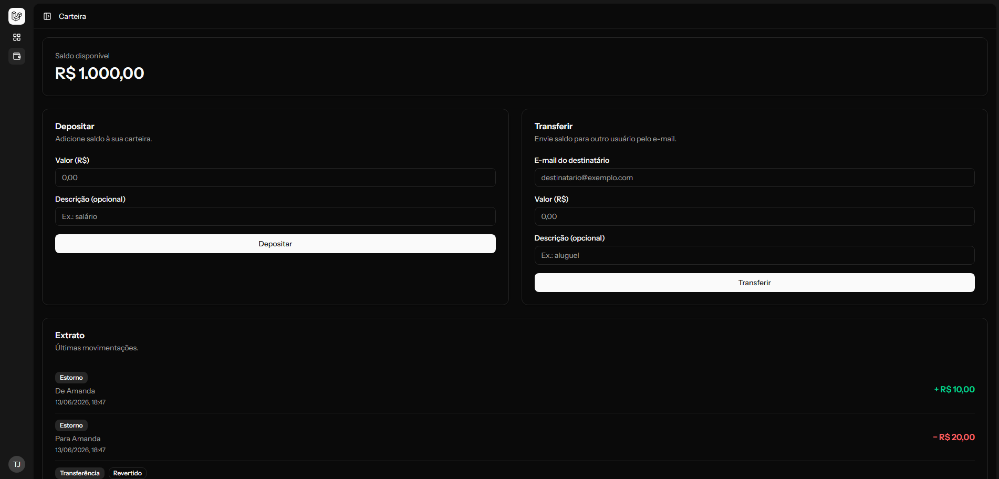
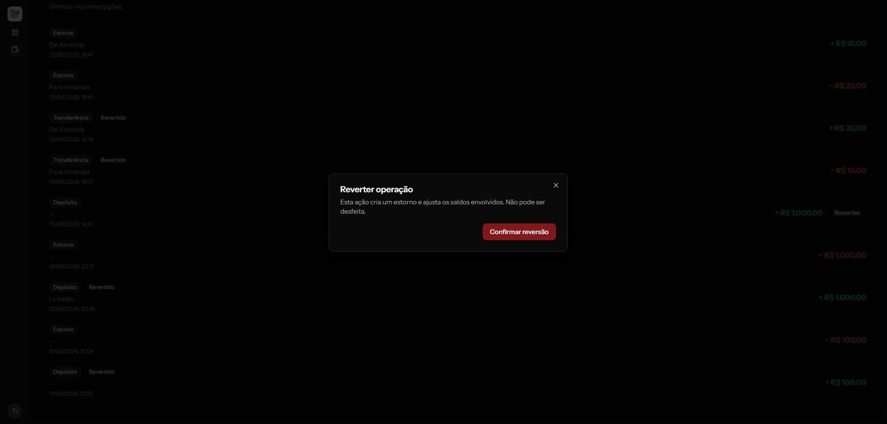

# Financial Portfolio

Carteira financeira. Usuários podem **depositar, transferir e receber**
dinheiro, com **validação de saldo** e **reversão** de operações. Construída em Laravel 13 +
Inertia v3 + React 19, com ambiente de desenvolvimento em Docker (Nginx + PHP-FPM 8.5 +
MySQL 8.4 + Vite).

## Telas

Carteira — saldo, depósito, transferência e extrato:



Reversão de uma operação (estorno com confirmação):



## Arquitetura

### Camadas (fluxo de uma requisição)

```
Rota → Form Request (validação) → Controller (orquestra) → WalletService (regras de negócio)
     → Eloquent (persistência) → Resource (formato de saída)
```

- **Controllers**: apenas orquestram. As regras vivem no `WalletService`.
- **`WalletService`** concentra as três operações (`deposit`, `transfer`, `reverse`), sempre
  dentro de `DB::transaction` com `lockForUpdate` (lock pessimista).
- **Sem Repository**: o Eloquent (Active Record) já é a camada de dados; uma abstração por
  cima seria indireção redundante para um único ORM.
- **Autorização por Policy nativa** (`TransactionPolicy`): cada usuário só age sobre as
  próprias operações.

### Modelo de dados

| Tabela | Papel |
|--------|-------|
| `wallets` | 1:1 com `users`. `balance` em **centavos** (inteiro), atualizado sob lock. |
| `transactions` | **Ledger imutável** — fonte de verdade e trilha de auditoria. |

Colunas-chave de `transactions`: `type` (deposit/transfer/reversal), `direction`
(credit/debit), `amount` (centavos), `balance_after`, `reference` (ULID que agrupa os
lançamentos de uma operação), `counterparty_wallet_id`, `reverses_transaction_id`,
`requested_by_user_id`, `idempotency_key`, `reversed_at`.

- **Saldo materializado** na `wallet` (coluna `balance`), recalculado dentro da transação de
  banco. O ledger é o histórico; o saldo é o agregado para leitura rápida. Invariante testada:
  `balance` = soma do ledger.
- **Transferência** = 2 lançamentos (débito na origem + crédito no destino) com a mesma
  `reference` (correlation id).
- **Reversão** = lançamentos de **estorno** (inversos), nunca `delete`. O ledger permanece
  imutável.

### Regras de negócio

- **Depósito** sempre soma ao saldo, **mesmo se negativo** (abate dívida).
- **Transferência** valida saldo antes (`InsufficientBalanceException`), é atômica e não
  permite transferir para si mesmo. Destinatário identificado por **e-mail**.
- **Reversão** pode ser solicitada por **qualquer participante** da operação; registra quem
  solicitou; não reverte duas vezes nem reverte um estorno.

### Decisões e trade-offs (o porquê)

- **Valores em centavos** (inteiro), nunca float/decimal — elimina erro de arredondamento.
  A conversão reais→centavos acontece só na borda (`App\Support\Money::toCents`, testado
  isoladamente).
- **`reference` (correlation id)** em vez de "id do lançamento oposto": evita o problema
  ovo-galinha na criação, funciona para depósito (que não tem oposto) e escala para operações
  com mais de 2 lançamentos.
- **Lock pessimista ordenado por id** (`lockForUpdate`): garante consistência do saldo sob
  concorrência e evita deadlock.
- **Idempotência** em depósito/transferência: chave UUID (gerada no front, por operação) +
  constraint `UNIQUE(requested_by_user_id, idempotency_key)`. Pré-check pega o retry
  sequencial; a constraint pega a corrida. Evita operação duplicada por duplo-clique/retry.
  A reversão dispensa chave — é idempotente por natureza (estado terminal `reversed_at` + lock).

### Segurança e observabilidade

- **Rate limiting** (`throttle:20,1` por usuário) nas rotas financeiras e `5/min` no login.
- **Trilha de auditoria imutável**: a tabela `transactions` é um ledger _append-only_ — nada é
  editado nem apagado, e uma reversão é um novo lançamento inverso. O histórico financeiro é
  sempre reconstruível.
- **Logging estruturado das operações** (`wallet.deposit`/`transfer`/`reversal`, nível `info`)
  com contexto, registrado **após o commit** (nunca loga uma operação desfeita por rollback).
- **Logging das falhas e eventos de risco** (nível `warning`), o que mais interessa para
  detecção: tentativas barradas de operação (`wallet.*.failed` com o motivo — saldo
  insuficiente, valor inválido, reversão dupla etc.), reversão não autorizada
  (`wallet.reversal.unauthorized`), login com senha errada (`auth.login.failed`) e bloqueio por
  throttle (`auth.login.lockout`).
- **Health check** em `/up` (nativo do Laravel).

> Os logs vão para `storage/logs/laravel.log` (canal `stack`). Em produção, a evolução natural é
> apontar o canal para `stderr` e agregar num coletor externo (Loki, CloudWatch, Sentry) — basta
> trocar `LOG_CHANNEL`/`LOG_STACK` no ambiente, sem mudança de código.

### Endpoints

| Método | Rota | Ação |
|--------|------|------|
| `GET`  | `/wallet` | Saldo + extrato (`WalletController@show`) |
| `POST` | `/wallet/deposits` | Depósito (`DepositController`) |
| `POST` | `/wallet/transfers` | Transferência (`TransferController`) |
| `POST` | `/transactions/{transaction}/reversals` | Reversão (`TransactionReversalController`) |

### Testes

Suíte em **Pest 4** (unitários + integração), com análise estática **Larastan** e formatação
**Pint** verificadas no CI. Rodar:

```bash
docker compose exec app php artisan test --compact
```

## Requisitos

- [Docker](https://docs.docker.com/get-docker/) e Docker Compose
- [gitleaks](https://github.com/gitleaks/gitleaks/releases) (para o hook de pré-commit)

## Subindo o projeto

```bash
# 1. Clonar
git clone git@github.com:Thiagopg7/financial-portfolio.git
cd financial-portfolio

# 2. Criar o .env a partir do exemplo
cp .env.example .env

# 3. Definir a senha do banco (o MySQL do container usa o mesmo valor).
#    Use a senha que quiser; precisa ser não-vazia.
sed -i 's/^DB_PASSWORD=.*/DB_PASSWORD=secret/' .env

# 4. (Opcional) Casar o UID/GID do container com o seu usuário
echo "UID=$(id -u)" >> .env
echo "GID=$(id -g)" >> .env

# 5. Subir os containers (a primeira vez compila a imagem; o serviço node já
#    instala as dependências de front-end com `npm install`)
docker compose up -d --build

# 6. Instalar as dependências PHP (gera a pasta vendor/)
docker compose exec app composer install

# 7. Gerar a APP_KEY e rodar as migrations (com dados de demonstração)
docker compose exec app php artisan key:generate
docker compose exec app php artisan migrate --seed
```

Acesse **http://localhost:8000**.

> Na primeira subida o container `node` arranca em paralelo com o `app`, antes do
> `composer install` do passo 6. Como o Vite roda `php artisan wayfinder:generate`
> ao iniciar e isso exige a pasta `vendor/`, ele falha nessa primeira tentativa —
> mas o serviço tem `restart: unless-stopped` e se recupera sozinho assim que as
> dependências PHP existem. Não é preciso reiniciá-lo manualmente.

> O Vite (assets/HMR) sobe junto no container `node` e leva alguns segundos para
> ficar pronto na primeira vez. Acompanhe com `docker compose logs -f node`.

## Credenciais de demonstração

O `--seed` cria três usuários já com saldo e um histórico de exemplo (depósitos,
transferências e um estorno), para testar a carteira de imediato. A senha de todos é
`password`.

| Nome | E-mail | Saldo inicial |
|------|--------|---------------|
| Ana Souza | `ana@example.com` | R$ 750,00 |
| Bruno Lima | `bruno@example.com` | R$ 650,00 |
| Carla Dias | `carla@example.com` | R$ 400,00 |

Para testar uma **transferência**, entre como Ana e envie um valor para `bruno@example.com`.
Para testar um **estorno**, abra o extrato e use o botão de reverter em um lançamento. Para
recriar os dados do zero: `docker compose exec app php artisan migrate:fresh --seed`.

## Serviços

| Serviço | Imagem / Build | Porta (host) | Papel |
|---------|----------------|--------------|-------|
| `web`   | `nginx:1.27-alpine` | `8000` | Entrada HTTP; serve `public/` e faz `fastcgi_pass app:9000` |
| `app`   | `docker/php/Dockerfile` (`php:8.5-fpm`) | — | PHP-FPM (artisan, filas) |
| `db`    | `mysql:8.4` | — (ver override) | Banco; dados no volume `mysqldata`. Não exposto no host por padrão |
| `node`  | mesmo Dockerfile do `app` | `5173` | Vite + HMR |

### Acesso ao banco por um cliente (DBeaver, Workbench, ...)

Por padrão o MySQL **não fica exposto no host** — só é acessível pela rede interna
do Compose (a aplicação o alcança como `db:3306`). Para abrir uma porta no host e
conectar com um cliente, crie um override local:

```bash
cp docker-compose.override.yml.example docker-compose.override.yml
docker compose up -d   # aplica o override
```

O `docker-compose.override.yml` é carregado automaticamente pelo Compose e **não é
versionado** — cada máquina escolhe a porta livre que quiser (ajuste no arquivo se
a `3306` já estiver ocupada por um MySQL local, ex.: `"3307:3306"`).

Depois, conecte com:

- **Host:** `127.0.0.1` · **Porta:** a que você definiu no override (ex.: `3306` ou `3307`)
- **Banco:** `financial_portfolio` · **Usuário:** `laravel` · **Senha:** a do `DB_PASSWORD` do seu `.env`
- Para acesso total, use `root` com a mesma senha.

## Comandos do dia a dia

```bash
docker compose up -d                              # sobe tudo
docker compose down                               # para (mantém o volume do MySQL)
docker compose down -v                            # para e APAGA os dados do banco

docker compose exec app php artisan <cmd>         # artisan
docker compose exec app php artisan test --compact
docker compose exec app composer <cmd>            # composer

docker compose logs -f node                       # logs do Vite
docker compose logs -f app                        # logs do PHP-FPM

docker compose build                              # rebuild após mudar o Dockerfile
```

## Hook de pré-commit (gitleaks)

O hook em `.githooks/` bloqueia commits com segredos. Em cada máquina nova:

```bash
git config core.hooksPath .githooks   # ou: composer hooks:install
```

E instale o binário do `gitleaks` (ver [releases](https://github.com/gitleaks/gitleaks/releases)).

## Problemas comuns

- **`502 Bad Gateway` no `:8000`** — o Nginx cacheou um IP antigo do `app` (ocorre
  após recriar só esse container). Resolva com `docker compose restart web`.
- **Tela sem estilo / "Vite manifest not found"** — o Vite ainda não subiu; aguarde
  ou verifique `docker compose logs node`.
- **Porta em uso ao expor o banco** — já existe um MySQL local na porta escolhida.
  Edite o seu `docker-compose.override.yml` e use outra porta de host (ex.: `"3307:3306"`).
